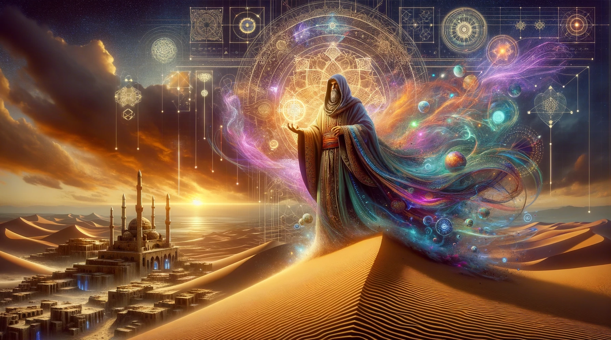

## Image Generation using Dall-E 3
DALL-E 3, the latest iteration of OpenAI's image generation AI, has the remarkable ability to create images from textual descriptions. With advancements in AI image generation methods, DALL-E 3 offers users an intuitive and powerful tool to bring their imaginations to life. To use the DALL-E 3 API effectively, you need to understand the command syntax that instructs the AI on what kind of images you want to generate. In this article, we will delve into the command syntax for DALL-E 3 and explain how AI images are generated using diffusing techniques which underpin this cutting-edge technology.

### Understanding the Command Syntax:
The command syntax `/openai dalle images prompt:<prompt> [size:<size>] [style:<style>] [quality:<quality>]` is a structured instruction that tells DALL-E 3 what kind of image you want to produce. This command is unique to the **Stupid AI Stuff Bot**, however its parameters are directly derived from the [OpenAI API](https://platform.openai.com/docs/api-reference/images). 

### Parameters
- `prompt:<prompt>`: This parameter specifies the textual description from which the AI will generate an image. The prompt can be anything from a simple object ("a two-tiered chocolate cake") to complex scenes or abstract concepts ("a futuristic cityscape with flying cars in the style of cyberpunk"). With Dall-E 3, The system expects extremely detailed prompts to create high quality images. Similar to the text api for GPT-4, simple requests with simple requirements generally generate simple results. Likewise, it is wise to utilize longform prompts with Dall-E 3. 

    We have introduced a feature to the [/gpt4 full_context Command]() to generate an image from this .

- `size:<size>`: With this parameter, you can define the resolution or dimensions of the output image. Only 3 Sizes are available, Must be one of `1024x1024`, `1792x1024`, or `1024x1792`. The *default* value for this parameter if omitted its `1024x1024`.

- `style:<style>`: Defines internal parameters to produce a `natural` or `vivid` image. The *default* value for this parameter if omitted is `vivid`, because we are cool like that 😎.

- `quality:<quality>`: Defines internal parameters to produce a `standard` or `hd` image. It is **strongly** recommended to use `hd`. The *default* value for this parameter if omitted is `hd`.

## How AI Images Are Generated Using Diffusing Techniques:
The core technology behind image generation in DALL-E 3 involves a process called diffusion, a type of generative modeling technique. Diffusion models work somewhat like reversing a diffusion process—the way ink disperses gradually in water—by learning how to start from a distribution of random noise and progressively refine it into a coherent image.

Here’s an overarching view of how diffusion models generate images:

1. **Training Phase**: During training, a diffusion model learns how data (like images) transform as they undergo a forward diffusion process. This process is essentially adding noise to an image incrementally until only random noise remains. The model learns this by being exposed to vast datasets of images at various stages of noisiness.

2. **Sampling Phase**: To generate new images, the model performs the reverse process by starting with noise and gradually removing it. At each step called 'denoising,' the model makes informed predictions about what features should emerge based on its understanding from the training phase.

3. **Guidance**: For controlled generation (like DALL-E's capabilities), textual descriptions (prompts) guide these predictions—essentially telling the model what kind of features and overall image it should be aiming for as it denoises.

Distilling it down:

- A user inputs a prompt along with specifics related to size, style, and quality.
  
- The AI begins with noise at a level corresponding to maximum randomness.
  
- Using reverse diffusion driven by both its training and the input prompt, it incrementally refines this noise.
  
- Precise adjustments guided by advanced algorithms shape this noise into an image matching the requested characteristics.

Understanding these underlying diffusing techniques gives users insight into why certain prompts might lead to exceptional results while others could be more challenging for AI. A well-crafted prompt aligned with the styles and patterns recognized during its training will yield better outcomes.

Conclusion:
To effectively utilize DALL-E 3's capabilities via its API, mastering its command syntax is crucial. As we've seen, you need to be specific about your desired outcomes in terms of prompt content, image size, aesthetic style, and quality level. Behind this interface lie sophisticated diffusion-based generative models that are redefining what's possible in creative AI-driven image synthesis. By issuing properly structured commands adhering to DALL-E 3's syntax conventions and understanding its processing techniques, users can tap into an unprecedented level of creative freedom and innovation.