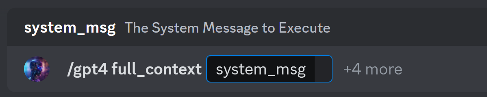
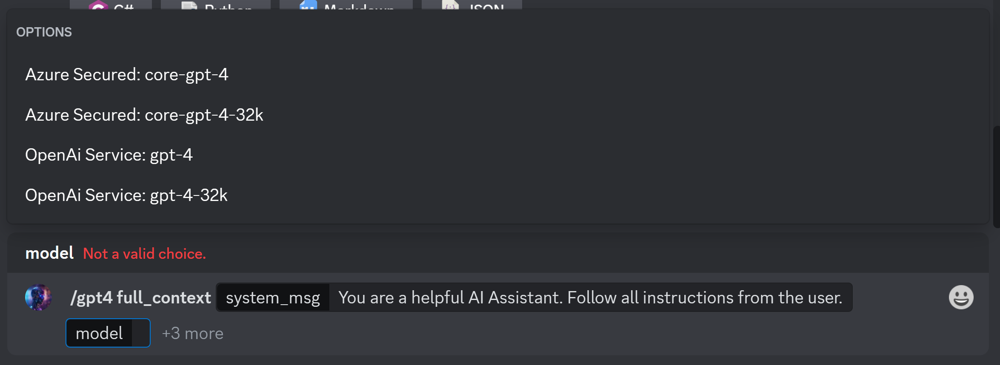
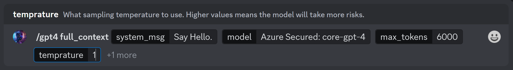
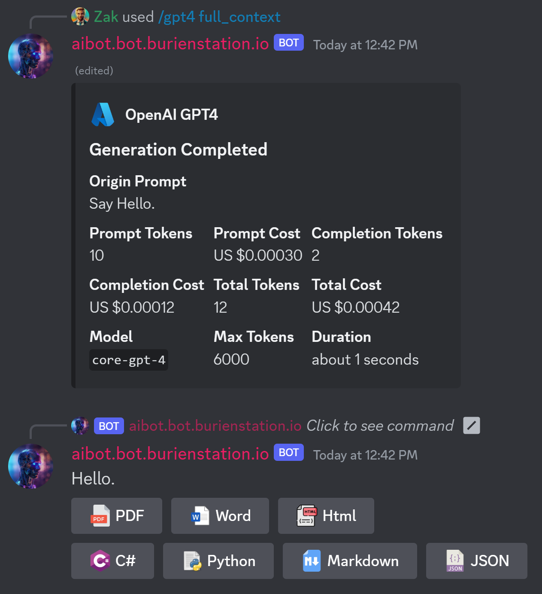
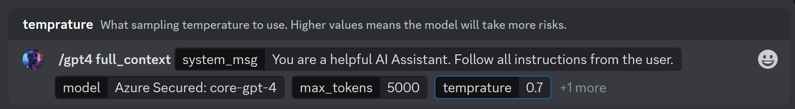
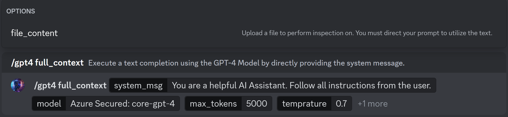
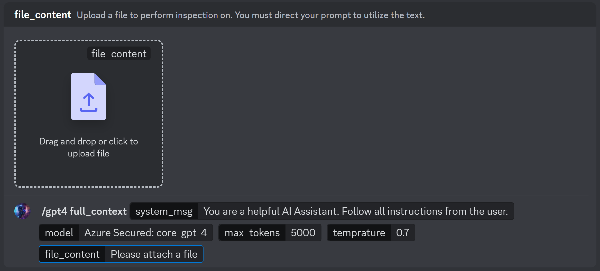

## Synopsis
This article will cover the use of the `/gpt4 full_context` command in discord. This command uses the [Discord Application Command Interface](https://discord.com/developers/docs/interactions/application-commands) to interact with the user. This means that all interactions begin with a `/` character.

{:toc}

## Command Use
The `/gpt4 full_context` command is intended for a more exact approach to interacting with the AI. It is not designed to run conversationally, and responses will not be stored in the history of the chat. 

> **It is highly recommended not to use `/` commands inside of a chat channel other than `/chat *` commands**

The expectation for use of the `/gpt4 full_context` is that the user will pre-prepare a text file (`.txt` or `.md`) for use with the bot. While conversion from Word and other formats is supported, it does not yeild expected results at this time. 



By default, the command will only **require** you to input the [System Message](), however this is **not an effective way to use the command**. For short / simple queries - it is best / most intuitive to use the Chat interface. It is highly recommended that you fill out all the other parameters.

### System Message (`system_msg`)
The System Message sets the 'global rules' of the interaction. Often when working with a pre-prepared document with this command, it is not necessary to include a complex system message. If you find yourself processing *many* different files and including the same prompt fragments in them (for example "`Format the output as Markdown.`"), you can place these fragments in the System Message. Please see the [Chat Completions]() article for more information on how the **System Message** differes from **User Messages** and **Assistant Messages**.

For processing most prompts where most of the information is included in the uploaded file, the System Message can be set to "`You are a helpful AI Assistant. Follow all instructions from the user.`". By using this system message, you are ensuring the the user message (the uploaded file) is unrestricted in its instructions. 

### Language Model (`model`)



It is **always** recommended to use the `Azure Secured: core-gpt-4` model. The `32k` variant of the model does not include additional performance, it is designed to handle enormous queries, and is thusly priced higher. Usage of the `32k` variant for small queries is unnecessary. 

### Token Budget (`max_tokens`)
The `max_tokens` argument is used to set a **maximum** budget, in [tokens](), for the produced content. This is most used for limiting the size of your produced content. For example for LLM queries that produce a `yes`/`no` output, the `max_tokens` parameter can be set to `3`. For an essay length output, the `max_tokens` parameter might be set to `2000`. 

#### Billing Implications
Please Note that billing only occurs for **used tokens** not the maximum budget. For example, the prompt `say hello` with a max tokens of `6000` will only use a total of `12` tokens (`10` for prompt, `2` for completion).




{:width="500px"}


In addition, the output of the `/gpt4 full_context` command will show the billing usage of each invocations. If you are using this tool to craft prompts for programatic use, you can consume this information to better prepare your `max_tokens` parameter.

#### Doing Math 😲
For each of the models, you have a fixed and finite **maximum** token budget to work from. The formula to compute your `max_token` remaining budget is simple. Please see the [tokens]() article for an in depth write up of Tokens, as they are not 100% intuitive.

```
model_limit - prompt_tokens = remaining_tokens
```

For each of the models, there is a model token limit.

| Model Name | Maximum Tokens Available | 
| :--------- | -----------------------: |
| `gpt-4` (Azure Secured: core-gpt-4) | 8,000 |
| `gpt-4-32k` (Azure Secured: core-gpt-4-32k) | 32,000 |

For example if you were using the `gpt-4` model and had crafted a prompt that was 250 tokens, you would have 7,750 tokens remaining for completion budget. **Setting a `max_tokens` parameter higher than this remaining token value will cause an error**.

### Temperature (`temperature`)
The `temperature` parameter is an internal paramter in the OpenAI system, that **effectively** will set the 'creativity' of the output. A higher value means a higher liklihood of the Model introducing new content. This value must be from `0.0` to `1.0` and must be formatted as a plain decimal number (`1`, `0.3`, `0.50283`).

The default value for this parameter is `0.7`



### Uploading a File (`file_content`)



Clicking on this parameter will add an inteface to discord allowing you to upload a single file.



#### Example
For our example, we are using the AI bot to create a lesson plan for a chemistry class demonstration. To show the precision in which the AI is able to infer context, our example includes no details of the lesson or any suggestions on how the AI might accomplish this goal.

##### Input
The following content was saved as a text file (such as `chemistry_demonstration.txt`)
```
## Instructions
Please create a Chemistry Demonstration for a High School Chemistry Class that meets all of the following requirements. The demontsration should be fun, engaging, and exciting. Prepare the output in the form of a lesson plan complete with:
- Materials Needed
- Instructions on how to perform the task. These instructions should be written for a high school level of knowledge. Plese be verbose and explain each step.
- Time taken for each step. 
- Expected outcomes if possible for each step. This will help assist the student in knowning if they have performed the task successfully.
- Brief, 4 paragraph introduction to the subject matter required to reach the goal. This section is meant to be read by the instructor to the class as an introduction to the demonstration. Ensure that it is engaging and builds excitement for the following demonstration or lab.

## Data
Subject: Introduction to Chemistry
Goal: Teach students about the valence electron shell, showing that the number of valence electrons determines reactivity for most substances.

## Requirements
- Lab Exercise

## Optional Requirements
None
```

##### Output
The following output was created by the AI. Please note that using this same prompt again will produce a different output, perhaps even a different lesson plan altogether. *Please Note: this is expected behavior from the AI*.

**Introduction to the Chemistry Demonstration**

Today, we have an exciting chemistry demonstration that will help you explore the world of atoms and their valence electrons. Valence electrons are the electrons in the outermost shell of an atom, and they play a crucial role in determining the chemical properties of elements. By the end of this demonstration, you will gain a deeper understanding of how valence electrons influence the reactivity of substances.

In this demonstration, we will be observing the reaction of alkali metals with water, showcasing the concept of reactivity in relation to the valence electron shells. As we move through the alkali metal family, you'll be fascinated by the changes in the reactivity and the reason behind it. This hands-on experience will not only be educational, but also fun and engaging.

So, get ready to dive into the world of chemistry and valence electrons! By the end of this demonstration, you will have a better understanding of the atomic structure and the significance of valence electrons in determining the reactivity of elements. Let's get started and witness some amazing chemical reactions!

**Materials Needed**

1. Safety goggles and gloves
2. Alkali metals: Lithium (Li), Sodium (Na), and Potassium (K) (small pieces, stored under mineral oil)
3. Small plastic or glass containers (3)
4. Dropper
5. Distilled water
6. Forceps
7. Fire extinguisher or sand bucket (for safety)
8. Teacher supervision

**Instructions on How to Perform the Task**

*(Ensure that all students are wearing safety goggles and gloves throughout the demonstration, and that a teacher is supervising the demonstration.)*

1. Time: 1 minute – In three separate containers, place small pieces of Lithium, Sodium, and Potassium. Make sure to handle them with forceps, as alkali metals are highly reactive.

2. Time: 4 minutes – Carefully remove the alkali metals from the mineral oil, and use a paper towel to gently wipe off any excess oil from their surface.

3. Time: 2 minutes – Fill the dropper with distilled water.

4. Time: 3 minutes – Starting with Lithium, carefully add drops of distilled water to the container with the alkali metal. Observe the reaction, noting the amount of fizzing and any other observations.

5. Time: 3 minutes – Repeat step 4 with Sodium, and then with Potassium, comparing the reactivity of each metal.

6. Time: 5 minutes – Discuss the observations, relating them to the atomic structure and the number of valence electrons in each alkali metal.

**Expected Outcomes for Each Step**

1. The alkali metals should be safely stored in their respective containers.

2. The alkali metals should be free from any visible mineral oil.

3. The dropper should be filled with distilled water.

4. Lithium should show some fizzing reaction when it comes in contact with water, producing hydrogen gas. This is due to the presence of one valence electron in its outermost shell, which it easily loses to react with the water.

5. Sodium should exhibit a more vigorous reaction than Lithium, with more fizzing and possibly a small flame. Potassium should demonstrate an even more vigorous reaction, potentially producing a lilac-colored flame. As we move down the alkali metal group, the number of shells increases, resulting in a higher reactivity due to the valence electron being further away from the nucleus and more easily lost.

6. The discussion should revolve around the differences in reactivity of the alkali metals, emphasizing the importance of valence electrons and their influence on chemical properties.


